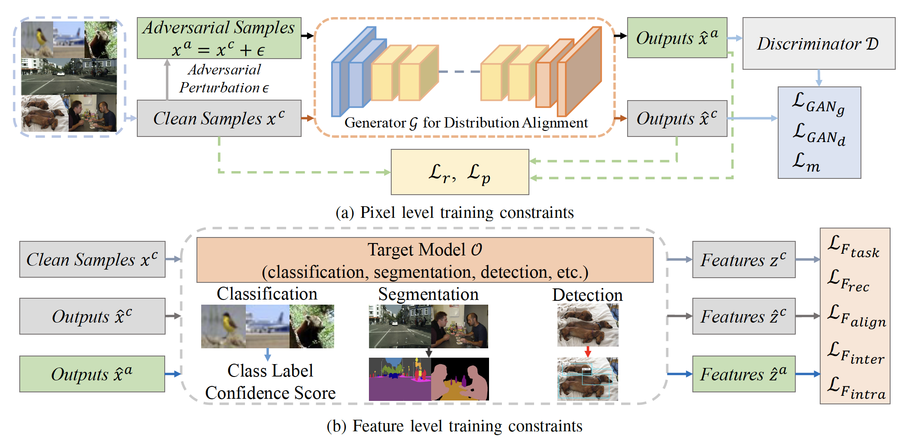
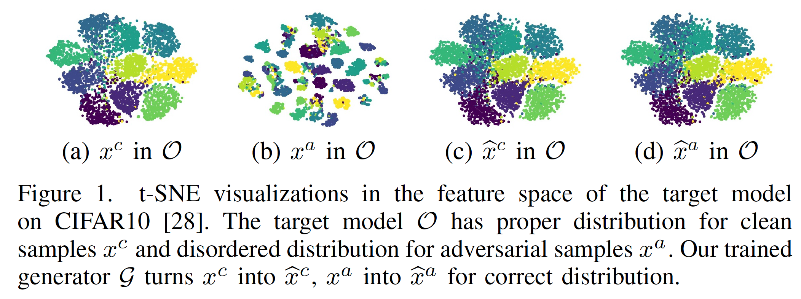

# General Adversarial Defense Against Black-box Attacks via Pixel Level and Feature Level Distribution Alignments

This is a pytorch project for the paper [**General Adversarial Defense Against Black-box Attacks via Pixel Level and Feature Level Distribution Alignments**] by Xiaogang Xu, Hengshuang Zhao, Philip Torr and Jiaya Jia.

## Introduction
Deep Neural Networks (DNNs) are vulnerable to the black-box adversarial attack that is highly transferable. This threat comes from the distribution gap between adversarial and clean samples in feature space of the target DNNs. 
In this paper, we use Deep Generative Networks (DGNs) with a novel training mechanism to eliminate the distribution gap. The trained DGNs align the distribution of adversarial samples with clean ones for the target DNNs by translating pixel values. 
Different from previous work, we propose a more effective pixel-level training constraint to make this achievable, thus enhancing robustness on adversarial samples. Further, a class-aware feature-level constraint is formulated for integrated distribution alignment. 
Our approach is general and applicable to multiple tasks, including image classification, semantic segmentation, and object detection. We conduct extensive experiments on different datasets. Our strategy demonstrates its unique effectiveness and generality against black-box attacks






[paper link](https://arxiv.org/abs/2212.05387)

## Project Setup

First install Python 3. We advise you to install Python 3 and PyTorch with Anaconda:

```
conda create --name py36 python=3.6
source activate py36
```

Clone the repo and install the complementary requirements:
```
cd $HOME
git clone --recursive git@github.com:xiaogang00/Adversarial_Distribution_Alignment.git
cd ddcat
pip install -r requirements.txt
```

The environment of our experiments is CUDA10.2 and TITAN V.

## Requirement

- Hardware: 1 GPU (better with >=11G GPU memory)

## Train

- Download related datasets, including Cityscapes and VOC2012 for semantic segmentation, CIFAR10, CIFAR100, and TinyImageNet for image classification, VOC07+12 for object detection
- Modify the data path for CIFAR10 by modifying "root" in [custom_dataset_data_loader_cifar10.py](data/custom_dataset_data_loader_cifar10.py)
- Modify the data path for CIFAR100 by modifying "root" in [custom_dataset_data_loader_cifar100.py](data/custom_dataset_data_loader_cifar100.py)
- Modify the data path for TinyImageNet by modifying "train_dir" in [custom_dataset_data_loader_tinyimagenet.py](data/custom_dataset_data_loader_tinyimagenet.py)
- Modify the data path for Cityscapes by modifying "data_root" and "data_list" in [aligned_dataset.py](data/aligned_dataset.py)
- Modify the data path for VOC2012 by modifying "data_root" and "data_list" in [aligned_dataset2.py](data/aligned_dataset2.py)
- Modify the data path for VOC07+12 by modifying "VOC_ROOT" and "root" in [aligned_dataset3.py](data/aligned_dataset3.py)

For the dataset downloading of image classification, you can refer to [TRADES](https://github.com/yaodongyu/TRADES),
for semantic segmentation, you can refer to [semseg](https://github.com/hszhao/semseg),
for object detection, you can refer to [ssd](https://github.com/amdegroot/ssd.pytorch).

Also, download ImageNet pre-trained [models]((https://drive.google.com/open?id=15wx9vOM0euyizq-M1uINgN0_wjVRf9J3)) and put them under folder `initmodel` for weight initialization.

Finally, download the pretrained models for image classification, semantic segmentation, and object detection from [google pan](https://drive.google.com/file/d/1_A_ukOwVREcN9tXdWkVNcLlRYxsjpzzT/view?usp=share_link).
You should have "model_cls_NoD", "model_seg_NoD", and "model_det_NoD".

### Semantic Segmentation

#### Cityscapes

The "resume_path" in [pix2pixHD_model_cityscapes.py](models/pix2pixHD_model_cityscapes.py) is the path of pretrained model without defense, and we use the PSPNet as the example here

- Train the model on Cityscapes to protect PSPNet (train for at least 70 epochs)
  ```
  python train_cityscapes.py --name cityscapes_model_pspnet --no_instance --label_nc 20 --tf_log --model pix2pixHD_cityscapes
  ```

#### VOC2012

The "resume_path" in [pix2pixHD_model_voc2012.py](models/pix2pixHD_model_voc2012.py) is the path of pretrained model without defense, and we use the PSPNet as the example here

- Train the model on VOC2012 to protect PSPNet (train for at least 20 epochs)
  ```
  python train_voc2012.py --name voc_model_pspnet --no_instance --label_nc 22 --tf_log --model pix2pixHD_voc2012
  ```

### Image Classification

#### CIFAR10

The "resume_path" in [pix2pixHD_model_cifar10.py](models/pix2pixHD_model_cifar10.py) is the path of pretrained model without defense, and we use the WideResNet as the example here

- Train the model on CIFAR10 to protect WideResNet (train for at least 100 epochs)
  ```
  python train_cifar10.py --name cifar10_model_wideresnet --no_instance --label_nc 10 --tf_log --model pix2pixHD_cifar10 --n_downsample_global 2 --batchSize 64
  ```

#### CIFAR100

The "resume_path" in [pix2pixHD_model_cifar100.py](models/pix2pixHD_model_cifar100.py) is the path of pretrained model without defense, and we use the WideResNet as the example here

- Train the model on CIFAR100 to protect WideResNet (train for at least 100 epochs)
  ```
  python train_cifar100.py --name cifar100_model_wideresnet --no_instance --label_nc 100 --tf_log --model pix2pixHD_cifar100 --n_downsample_global 2 --batchSize 64
  ```

#### TinyImageNet

The "resume_path" in [pix2pixHD_model_tinyimagenet.py](models/pix2pixHD_model_tinyimagenet.py) is the path of pretrained model without defense, and we use the WideResNet as the example here

- Train the model on TinyImageNet to protect WideResNet (train for at least 30 epochs)
  ```
  python train_tinyimagenet.py --name tinyimagenet_model_wideresnet --no_instance --label_nc 200 --tf_log --model pix2pixHD_tinyimagenet --n_downsample_global 2 --batchSize 16
  ```

### Object Detection

#### VOC07+12

The "trained_model" in [pix2pixHD_model_voc_detection.py](models/pix2pixHD_model_voc_detection.py) is the path of pretrained model without defense, and we use the SSD as the example here

- Train the model on VOC07+12 to protect SSD (train for at least 70 epochs)
  ```
  python train_voc_det.py --name voc0712_model_ssd --no_instance --label_nc 22 --tf_log --model pix2pixHD_voc_det --batchSize 4
  ```

## Test

### Semantic Segmentation

#### Cityscapes
We provide the script for evaluation, reporting the miou on adversarial samples.
You should first modify the "data_root", "test_list", "colors_path", "names_path" according to your dataset path.
"save_folder" is the path to store the results, "save_path" is the path of trained generator.
"model_path" for "model" is the pretrained model without defense and the generator is trained to protect it.
"model_path" for "model_black" is the pretrained model without defense and adversarial perturbations can be generated from it.

- Test the model on Cityscapes to protect PSPNet
  ```
  python test_seg_cityscapes.py
  ```

#### VOC2012
We provide the script for evaluation, reporting the miou on adversarial samples.
You should first modify the "data_root", "test_list", "colors_path", "names_path" according to your dataset path.
"save_folder" is the path to store the results, "save_path" is the path of trained generator.
"model_path" for "model" is the pretrained model without defense and the generator is trained to protect it.
"model_path" for "model_black" is the pretrained model without defense and adversarial perturbations can be generated from it.

- Test the model on VOC2012 to protect PSPNet
  ```
  python test_seg_voc2012.py
  ```


### Image Classification
First, enter the dictionary of "test_cls"
```
cd test_cls
```
You should install [foolbox](https://github.com/bethgelab/foolbox) to conduct adversarial evaluation.

#### CIFAR10

We provide the script for evaluation, reporting the accuracy on adversarial samples.
You should first modify "root='../data'" according to your dataset path.
"save_path" is the path of trained generator.
"model_path_this" for "model" is the pretrained model without defense and the generator is trained to protect it.
"model_path_this" for "model_black" is the pretrained model without defense and adversarial perturbations can be generated from it.

- Test the model on CIFAR10 to protect WideResNet
  ```
  python eval_cifar10.py
  ```

#### CIFAR100

We provide the script for evaluation, reporting the accuracy on adversarial samples.
You should first modify "root='../data'" according to your dataset path.
"save_path" is the path of trained generator.
"model_path_this" for "model" is the pretrained model without defense and the generator is trained to protect it.
"model_path_this" for "model_black" is the pretrained model without defense and adversarial perturbations can be generated from it.

- Test the model on CIFAR100 to protect WideResNet
  ```
  python eval_cifar100.py
  ```

#### TinyImageNet

We provide the script for evaluation, reporting the accuracy on adversarial samples.
You should first modify "test_dir" according to your dataset path.
"save_path" is the path of trained generator.
"model_path_this" for "model" is the pretrained model without defense and the generator is trained to protect it.
"model_path_this" for "model_black" is the pretrained model without defense and adversarial perturbations can be generated from it.

- Test the model on CIFAR100 to protect WideResNet
  ```
  python eval_tinyimagenet.py
  ```

### Object Detection

First, enter the dictionary of "test_det"
```
cd test_det
```

#### VOC07+12

We provide the script for evaluation, reporting the accuracy on adversarial samples.
You should first modify "VOC_ROOT" and "VOCroot" according to your dataset path.
"save_path" is the path of trained generator.
"model_path" is the pretrained model without defense and the generator is trained to protect it.
"model_black_path" is the pretrained model without defense and adversarial perturbations can be obtained from it.

- Test the model on VOC07+12 to protect SSD
  ```
  python eval.py
  ```


## Citation Information

If you find the project useful, please cite:

```
@article{xu2022distribution,
  title={General Adversarial Defense Against Black-box Attacks via Pixel Level and Feature Level Distribution Alignments},
  author={Xiaogang Xu, Hengshuang Zhao, Philip Torr and Jiaya Jia},
  journal={arxiv},
  year={2022}
}
```


## Acknowledgments
This source code is inspired by [pix2pixHD](https://github.com/NVIDIA/pix2pixHD), [semseg](https://github.com/hszhao/semseg),
[TRADES](https://github.com/yaodongyu/TRADES), [ssd.pytorch](https://github.com/amdegroot/ssd.pytorch), and [RFBNet_Pytorch](https://github.com/jianzhnie/RFBNet_Pytorch).

## Contributions
If you have any questions/comments/bug reports, feel free to e-mail the author Xiaogang Xu ([xiaogangxu00@gmail.com](xiaogangxu00@gmail.com)).
